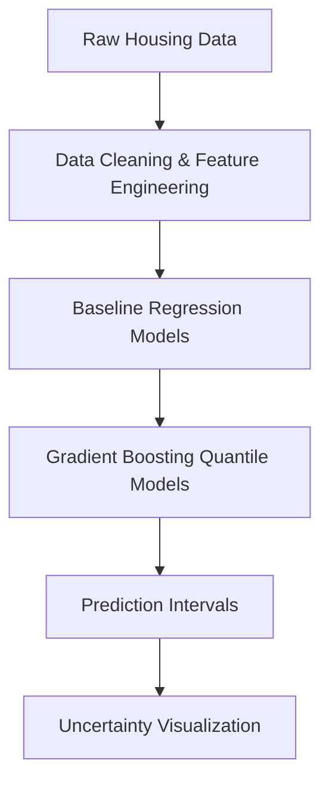

# House Price Prediction with Quantile Regression and Uncertainty Estimation
**TL;DR:** This project predicts house prices using regression models while estimating prediction uncertainty via quantile regression, producing interpretable price ranges instead of single-point estimates.


## Problem Statement
The objective of this project is to predict house prices using structured tabular data while explicitly modeling **prediction uncertainty** rather than relying only on point estimates.

Instead of answering *“What is the price?”*, the project focuses on *“What range can the price realistically fall into, and how uncertain is the prediction?”*

---

## Tech Stack

- Python
- Pandas
- NumPy
- Scikit-learn
- XGBoost
- Matplotlib / Seaborn

---

## Modeling Pipeline



---

## Repository Structure

```
house_prediction_uncertainty/
├── data/
│   ├── raw/
│   │   ├── train.csv
│   └── processed/
│       ├── house_prices_clean.csv
│       └── house_prices_features_v1.csv
│
├── notebooks/
│   ├── 01_eda.ipynb
│   ├── 02_feature_engineering.ipynb
│   ├── 03_modeling_baseline.ipynb
│   └── 04_uncertainty_modeling.ipynb
│
├── reports/
│   ├── figures/
│   │   ├── distribution_residuals.png
│   │   ├── residuals_vs_predicted_saleprice.png
│   │   ├── target_distribution_check.png
│   │   └── uncertainty_vs_price_level.png
│   └── summary_tables/
│       ├── comparison.csv
│       ├── example_predictions.csv
│       ├── model_summary.csv
│       └── results.csv
│
├── src/
│   ├── data_prep.py
│   ├── features.py
│   ├── train.py
│   ├── uncertainty.py
│   └── evaluate.py
│
├── requirements.txt
└── README.md

```
The project follows a notebook-driven workflow for exploration, with reusable modeling logic implemented in the `src/` directory.

---

## Data

**Dataset:** Ames Housing Dataset (Kaggle)

The dataset contains detailed information about residential homes including:

- Structural features (size, rooms, year built)
- Quality and condition ratings
- Location and neighborhood information
- Lot and property characteristics

Target variable:
- `SalePrice` — final house sale price

After cleaning and preprocessing, the dataset contains engineered features used for regression modeling.

---

## Modeling Approach

### Baseline Models
- Linear Regression
- Tree-based Regression (Gradient Boosting / XGBoost)

### Key Techniques
- Log transformation of the target variable
- Feature selection and encoding
- Regularization to prevent overfitting

---

## Uncertainty Modeling

### Why Uncertainty Matters
Single-point predictions hide risk. Two houses with the same predicted price may carry very different levels of uncertainty.
This project estimates prediction intervals to quantify downside and upside risk, enabling more informed decisions.

### Quantile Regression
Quantile Gradient Boosting models were trained separately for each quantile:
- Lower quantile (e.g. 10th percentile)
- Upper quantile (e.g. 90th percentile)

These models produce **prediction intervals** instead of a single price.

---

### Prediction Intervals
Each house prediction is represented as a range:
- **Lower bound**: conservative estimate
- **Upper bound**: optimistic estimate

Wider intervals indicate higher uncertainty, while narrower intervals indicate higher confidence.

---

### Visualization
- Error bars are used to visualize uncertainty
- Longer error bars → higher uncertainty
- Shorter error bars → more confident predictions

---

## Evaluation
- RMSE / MAE for point prediction accuracy
- Residual analysis
- Empirical coverage of prediction intervals
- Visual inspection of prediction intervals
- Example predictions with uncertainty ranges

---

## Key Results

### Prediction Interval Example


---

## Outputs
- Point predictions
- Prediction intervals (e.g 10th-90th percentile)
- Residual diagnostics
- Example predictions with uncertainty ranges

---

## Key Takeaways
- Point estimates alone hide risk in housing prices
- Uncertainty varies significantly across houses
- Expensive and rare properties tend to have wider prediction intervals
- Quantile regression exposes heteroskedasticity in housing prices

---

## Future Improvements
- Conformal prediction for guaranteed interval coverage
- Bayesian regression models
- Hierarchical modeling by neighborhood
- Temporal price trend modeling

---

## Setup
```bash
pip install -r requirements.txt
```